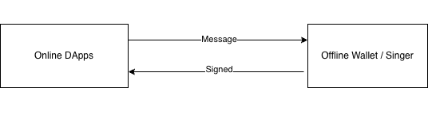

<!-- TOC -->
* [基于软件的双APP冷签方案](#基于软件的双app冷签方案)
  * [项目文档 (Documentation)](#项目文档-documentation)
  * [Isolated Offline Signer (IOS)](#isolated-offline-signer-ios)
  * [Architecture](#architecture)
    * [Workflow](#workflow)
    * [Feature](#feature)
    * [被限制的能力](#被限制的能力)
  * [App name](#app-name)
  * [Between Hardware Wallet](#between-hardware-wallet)
    * [Difference between Hardware Wallet](#difference-between-hardware-wallet)
    * [弱势](#弱势)
    * [优势](#优势)
  * [Between single App software Wallet](#between-single-app-software-wallet)
    * [优势](#优势-1)
  * [Offline Wallet Supported Platforms:](#offline-wallet-supported-platforms)
  * [Inter-App Communication（IAC）](#inter-app-communicationiac)
<!-- TOC -->

# 基于软件的双APP冷签方案

双APP指：

* DApps
* Signer

## 项目文档 (Documentation)

详细的设计方案与理论依据请参阅以下文档：

* **核心架构与演进**
    * [Wallet Architecture Evolution](doc/Wallet%20Architecture%20Evolution-zh.md) ([中文版](doc/Wallet%20Architecture%20Evolution-zh.md))
    * [Wallet Type & Comparison](doc/Wallet%20Type.md)
* **安全模型**
    * [Security Model](doc/Security%20Model.md) ([中文版](doc/Security%20Model-zh.md))
    * [Safety & Audit Considerations](doc/for%20safty-autiy.md)
* **其他**
    * [Terminologies / Word List](doc/word.md)

## Isolated Offline Signer (IOS)

A Software-based Out-of-Band Transaction Signing Architecture
通过独立的软件通道完成交易签名、与交易发起环境逻辑隔离的安全架构

## Architecture

### Workflow

1. DApp construct transaction
2. Signer sign transaction
3. DApp broadcast

### Feature

* 存储私钥, 私钥与应用层隔离
* 签名, Isolated Signing Environment
* 离线
* Open source
* 不向合约授权
* 介于Hardware Wallet 和 Hot Wallet 之间，双App + 不联网, 用户易于理解自己的私钥是安全的
* 应用 + Hot Wallet钱包，用户可选择Hot or Isolated Offline钱包签名
* Applications 调用Signer，无需每个app都做钱包
* Offline Signer开源，做为基础设施供行业使用，无需担心非开源Hot Wallet是否有风险

### 被限制的能力

* 不能向合约授权  
  合约授权交由Hot Wallet

## App name

Offline Signer

An Isolated, Offline Software Signing Web3 Wallet. Also is a Signer

## Between Hardware Wallet

把 Hardware Wallet 模型映射为 Signer 的架构（很重要）

Signer 实际上是：

> “用软件模拟 Hardware Wallet 的安全语义，但不宣称硬件级安全”

对应关系非常清晰：

| Hardware Wallet | Signer                           |
|-----------------|----------------------------------|
| PIN             | Key Encryption / Unlock Password |
| Secure Element  | App-level encrypted key storage  |
| Device Screen   | Signer UI                        |
| Physical Button | Explicit user approval           |

### Difference between Hardware Wallet

### 弱势

* 缺少加密芯片  
  区块链手机加入加密芯片后，该层级的安全性将与硬件钱包齐平
* 物理级隔离

### 优势

* 使用、普及方便，无需单独物理设备保存私钥

## Between single App software Wallet

### 优势

* 双App，用户易于理解私钥与应用层在不同的App，明确私钥是隔离的
* 用户可明确确认Signer未联网

## Offline Wallet Supported Platforms:

* Mobile
* Web
* Desktop

## Inter-App Communication（IAC）

* OS App IPC: (Android: Intent, IOS: Universal Link ...)
* Bluetooth
* Qrcode
