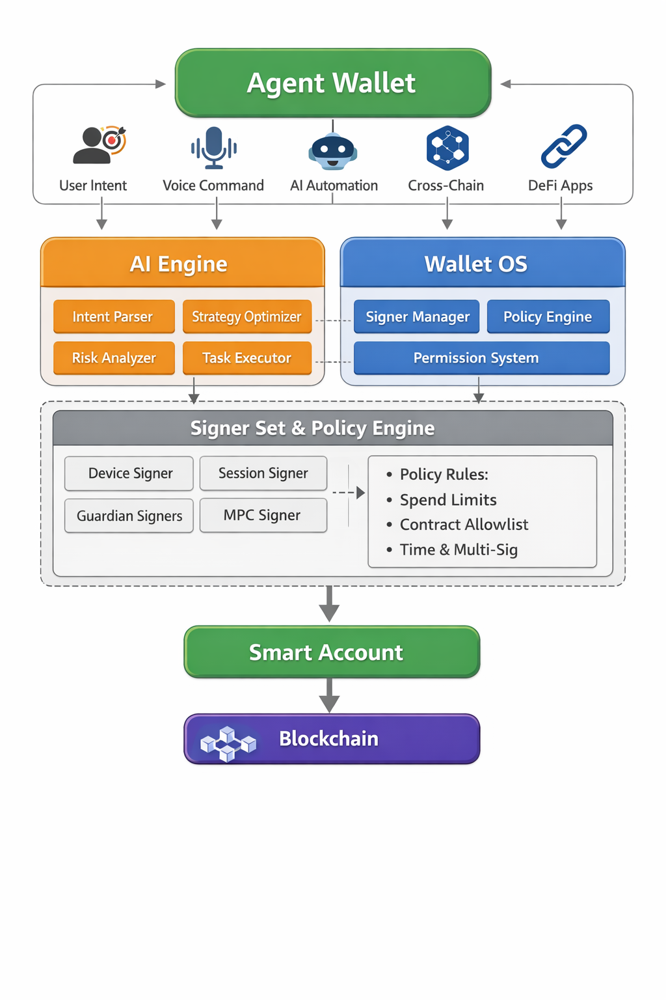

# Agent Wallet Architecture

Agent Wallet is a specialized wallet architecture designed for automated or delegated signing
scenarios.

## Architecture Diagram

## Key Concepts

* **Delegated Signing:** Allowing a specific "agent" to sign transactions under predefined
  constraints.
* **Separation of Concerns:** Distinct separation between the policy engine and the signing
  execution.
* **Security Boundaries:** Ensuring that the master key remains isolated even when delegated agents
  are active.
