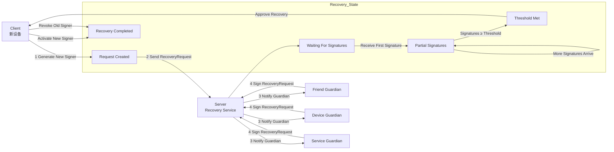

# Guardian Signer 交互流程（客户端 + 服务端 + Guardian）

## 1. 角色

- **客户端（User Device）**
    - 生成新 signer（私钥/公钥对）
    - 发起 Recovery Request
    - 收集 Guardian 签名
    - 替换旧 signer 并生效

- **服务端（Recovery Server / Coordination Layer）**
    - 管理 Guardian Set（列表、阈值规则、状态）
    - 验证 Recovery Request
    - 聚合签名并批准恢复
    - 通知客户端恢复完成

- **Guardian（设备 / 人 / 服务）**
    - 接收 Recovery Request
    - 验证请求合法性
    - 对请求签名
    - 返回签名给客户端或服务端

---

```text
用户新设备(Client)                服务端(Server)                  Guardian
        |                              |                              |
1. 生成新 signer & 发起请求          |                              |
        | -------- RecoveryRequest -->|                              |
        |                              | --> 通知 Guardian(s) ----> |
        |                              |                              |
        |                              |<---- Guardian 签名(s) -----|
        |<-- 收集签名/验证聚合 --------|                              |
        |                              |                              |
2. 客户端收到阈值签名                 |                              |
        |                              |                              |
3. 新 signer 生效，旧 signer 作废     |                              |

```


```