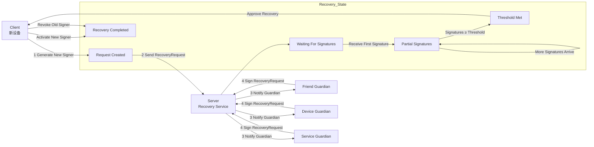

# Guardian Signer 交互流程详解
Guardian Signer（守护签名器）的实现思路，本质上是“多方授权的账户恢复机制”

本文档描述了在账户恢复场景下，客户端、服务端与 Guardian（守护者）之间的交互逻辑。

---

## 1. 角色定义 (Roles)

在恢复流程中，涉及以下三个核心角色：

* **客户端 (User Device / Client)**
    * **职责：** 生成新的 Signer（私钥/公钥对）；发起恢复请求 (Recovery Request)；收集并验证来自 Guardian
      的签名；生效新 Signer 并废弃旧 Signer。
* **服务端 (Recovery Server / Coordination Layer)**
    * **职责：** 管理 Guardian Set（成员列表、阈值规则、活跃状态）；验证恢复请求的合法性；协调并通知
      Guardian；聚合签名并批准恢复。
* **Guardian (守护者)**
    * **职责：** 接收恢复请求；通过带外方式（如身份确认、验证码等）验证请求真实性；对请求进行签名并将签名返回。
    * **类型：** 可以是好友设备、用户的其他硬件、或受信任的第三方服务机构。

---

## 2. 交互时序图 (Interaction Flow)

### 文本概览

```text
用户新设备(Client)                服务端(Server)                  Guardian
        |                              |                              |
1. 生成新 signer & 发起请求          |                              |
        | -------- RecoveryRequest -->|                              |
        |                              | --> 通知 Guardian(s) ----> |
        |                              |                              |
        |                              |<---- Guardian 签名(s) -----|
        |<-- 收集签名/验证聚合 --------|                              |
        |                              |                              |
2. 客户端收到阈值签名                 |                              |
        |                              |                              |
3. 新 signer 生效，旧 signer 作废     |                              |
```

### 状态机流转 (Mermaid)



---

## 3. 详细步骤拆解 (Workflow Details)

### 第一阶段：发起恢复

1. **Client**：生成一对新的 `new_signer_pk`（新公钥）。
2. **Client**：构造 `RecoveryRequest`（包含 UID、旧 Signer 信息、新公钥、时间戳等）。
3. **状态**：进入 `Request Created`。

### 第二阶段：服务端协调

1. **Server**：验证请求的基本格式和权限。
2. **Server**：根据用户的 Guardian 配置，通知对应的 Guardian（通过 Push、邮件、短信或应用内消息）。
3. **状态**：进入 `Waiting For Signatures`。

### 第三阶段：Guardian 签名

1. **Guardian**：在各自设备上看到恢复请求。
2. **Guardian**：验证操作者身份（线下确认或生物识别）。
3. **Guardian**：使用自己的私钥对 `RecoveryRequest` 进行签名，并返回给 Server。

### 第四阶段：阈值聚合

1. **Server**：聚合收集到的签名。
2. **判断**：如果 `有效签名数 >= 预设阈值`（例如 2/3），则判定恢复合法。
3. **状态**：进入 `Threshold Met`。

### 第五阶段：账户更新

1. **Client**：接收到来自 Server 的聚合证明。
2. **Client**：在本地安全存储中替换私钥，完成权限移交。
3. **状态**：`Recovery Completed`。

---

## 4. Web3 / 智能合约钱包中的落地

在实际的 **ERC-4337 (Smart Account)** 或 **社交恢复钱包** 架构中，逻辑会进一步延伸到链上：

### 角色映射

* **Relayer / Backend**：即上述的 Server。
* **Smart Contract Account**：最终的信任根。

### 链上执行路径

1. **Guardian Signatures**：收集到的签名。
2. **Submit to Chain**：由 Relayer 将签名和新公钥提交给智能合约。
3. **Contract Verification**：合约内部执行 `verifyThreshold()`。
4. **Update Owner/Signer**：合约更新内部存储的 `owner` 地址。

> **核心逻辑总结：**
> 恢复请求 → 守护者多签 → 链上/服务端验证阈值 → 更新 Signer 权限。
