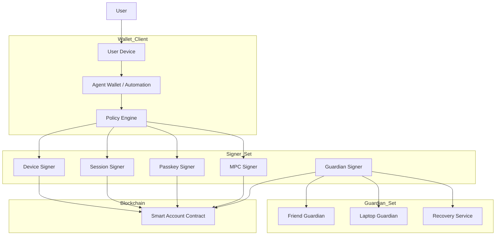

```mermaid
flowchart TB

%% ===== User Layer =====
User[User]

%% ===== Wallet Client =====
subgraph Wallet_Client
Device[User Device]
Agent[Agent Wallet / Automation]
PolicyEngine[Policy Engine]
end

%% ===== Signer Layer =====
subgraph Signer_Set
DeviceSigner[Device Signer]
SessionSigner[Session Signer]
PasskeySigner[Passkey Signer]
MPCSigner[MPC Signer]
GuardianSigner[Guardian Signer]
end

%% ===== Guardian Layer =====
subgraph Guardian_Set
Friend[Friend Guardian]
Laptop[Laptop Guardian]
RecoveryService[Recovery Service]
end

%% ===== Blockchain Layer =====
subgraph Blockchain
SmartAccount[Smart Account Contract]
end

%% ===== Flow =====

User --> Device
Device --> Agent
Agent --> PolicyEngine

PolicyEngine --> DeviceSigner
PolicyEngine --> SessionSigner
PolicyEngine --> PasskeySigner
PolicyEngine --> MPCSigner

GuardianSigner --> Friend
GuardianSigner --> Laptop
GuardianSigner --> RecoveryService

DeviceSigner --> SmartAccount
SessionSigner --> SmartAccount
PasskeySigner --> SmartAccount
MPCSigner --> SmartAccount

GuardianSigner --> SmartAccount
```